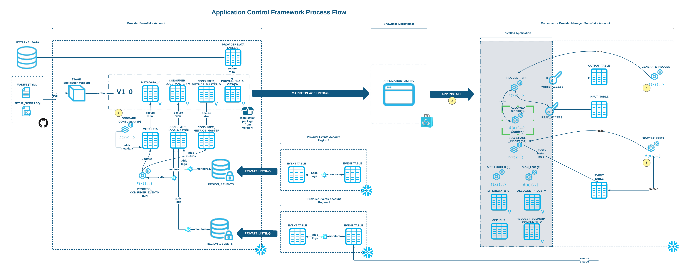

# Application Control Framework v1.6

Snowflake’s Application Control Framework (ACF) is a framework that allows an application developer (Provider) to integrate their existing application logic (already on Snowflake), with minimal/no modification, into a Snowflake Native App.  

The ACF has pre-built controls which allows the Provider to monitor and control application usage, for each Consumer.

In addition, the Provider can control which function(s)/stored procedure(s) the Consumer can access within the application.  The function(s)/stored procedure(s) will remain hidden from the Consumer, but accessible by the application.

## Design Diagram


## Prerequisites:
- The Provider must accept the Snowflake Marketplace Provider Terms of Service.
- The Consumer must accept the Snowflake Marketplace Consumer Terms of Service.
- The Provider must create an account that stores their native app Application Control Framework objects.
- The Provider must create an account in each cloud region their native app will be available in. This account is used to collect events from consumer apps in each region.  Events from this account are routed to the native app/ACF account via private data listings.
  - Each account must be enrolled in the Listing API Private Preview
  - Once this account is created, the Provider will set it as the Event account for the cloud region, by executing the following in the Snowflake Organization account, as ```ORGADMIN```
    - ```CALL SYSTEM$SET_EVENT_SHARING_ACCOUNT_FOR_REGION('<REGION>', 'PUBLIC', '<ACCOUNT_NAME>');```
      - The account region can be found by executing ```SELECT CURRENT_REGION();```
      - The account name can be found by executing ```SELECT CURRENT_ACCOUNT_NAME();```
    - ```CALL SYSTEM$ENABLE_GLOBAL_DATA_SHARING_FOR_ACCOUNT('<ACCOUNT_NAME>');```
      - The account name can be found by executing ```SELECT CURRENT_ACCOUNT_NAME();```
- The user that will execute the scripts in each account must have either the ```ACCOUNTADMIN``` role granted or a role that can create roles and manage grants on the account to other roles.

## Application Control Framework Deployment:
 - Follow the instructions in the **Application Control Framework - Deployment Guide** document to deploy and configure the ACF.

## Create a Native App via the Application Control Framework
 - Follow the instructions in the **Application Control Framework - Native App Deployment Guide** document to create a native app using the ACF.

## Create and Deploy a Demo Native App
 - Follow the instructions in the **Application Control Framework - Demo Setup Guide** document to create and use a demo native app, built via the ACF.
